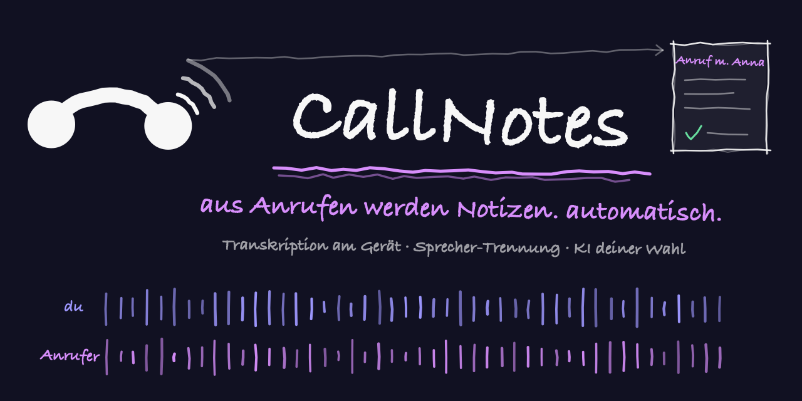
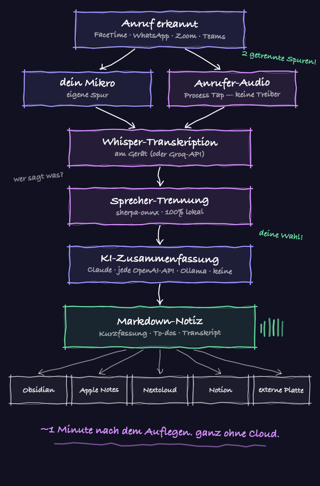
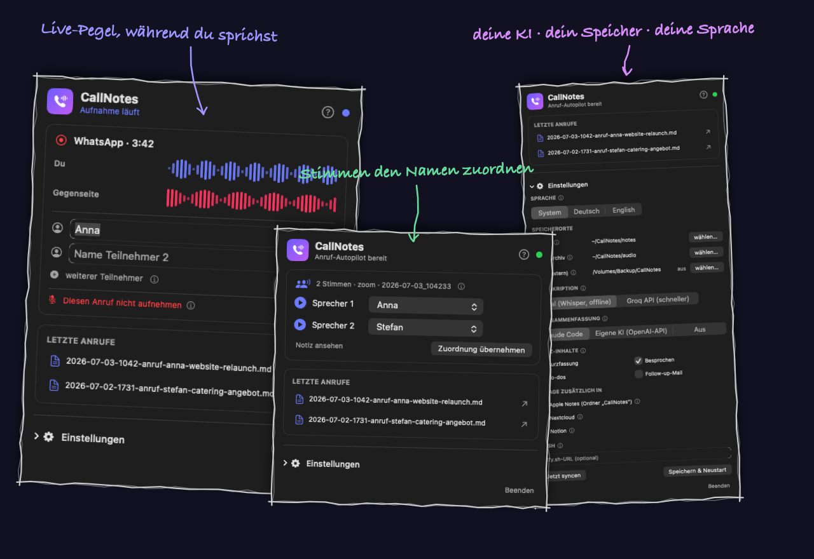

<p align="center">
  
</p>

<p align="center">
  <a href="README.md">🇬🇧 English</a>&nbsp;&nbsp;·&nbsp;&nbsp;<b>🇩🇪 Deutsch</b>
</p>

<h1 align="center">CallNotes</h1>

<p align="center">
  Du telefonierst am Mac — CallNotes nimmt <b>beide Seiten als getrennte Spuren</b> auf,
  transkribiert lokal mit Whisper, trennt die Sprecher und legt dir eine fertige,
  KI-zusammengefasste Notiz ab, wo du willst. Vollautomatisch, aus der Menüleiste.
</p>

<p align="center">
  
  
  
  <a href="https://github.com/michaelczesun/callnotes-windows"></a>
</p>

<p align="center">
  <sub>🪟 Auf Windows? Es gibt ein experimentelles Schwesterprojekt: <a href="https://github.com/michaelczesun/callnotes-windows"><b>callnotes-windows</b></a></sub>
</p>

---

## Warum es das gibt

Jedes Call-Recording-Tool braucht entweder einen virtuellen Audio-Treiber
(BlackHole/Loopback), einen sichtbaren Meeting-Bot oder ein Cloud-Abo. CallNotes nicht:

- **Core-Audio Process Taps** (macOS 14.2+) greifen das Systemaudio **nur der
  Call-App** ab — die Gegenseite landet auf ihrer eigenen Spur, Hintergrundmusik nicht.
- Dein Mikrofon läuft parallel — **zwei getrennte Spuren bedeuten perfekte
  Sprecher-Zuordnung bei 1:1-Anrufen**, ganz ohne KI-Raterei.
- Bei Konferenzen trennt eine lokale **Sprecher-Diarisierung** (sherpa-onnx) den
  Mix der Gegenseite in „Sprecher 1..N" — Namen ordnest du per Hör-Schnipsel und
  Dropdown zu.
- Transkription läuft **on-device** — whisper.cpp (Metal) oder **NVIDIA Parakeet TDT v3**
  (die schnellste Option, 25 EU-Sprachen, keine Wiederholungsschleifen) — oder über die
  Groq-API, wenn du Cloud-Tempo willst. Ein Schalter.
- **KI deiner Wahl** für die Zusammenfassung: Claude Code (Standard), jede
  OpenAI-kompatible API (OpenAI, Groq, OpenRouter) oder komplett lokal via **Ollama** —
  oder ganz ohne.

## Was du nach dem Auflegen bekommst

Eine fertige Markdown-Notiz, etwa eine Minute später:

- **Kurzfassung, besprochene Punkte, Zusagen & To-dos, offene Fragen** (Claude,
  optional — Sektionen frei wählbar, inklusive **Follow-up-Mail-Entwurf**)
- **Dialog-Transkript mit Sprechern** („Ich: … / Gesprächspartner: …") mit Zeitstempeln
- **Stereo-Audio-Archiv** (links = du, rechts = Gegenseite)
- Abgelegt im **Notizen-Ordner** (Obsidian-tauglich), optional zusätzlich in
  **Apple Notes, Nextcloud, Notion**, gespiegelt auf eine **externe Festplatte**,
  plus **ntfy-Push** aufs Handy

## So funktioniert es

<p align="center">
  
</p>

## Die Menüleisten-App

Alles sitzt in der Menüleiste (Telefon-Symbol):

- **Live-Ansicht im Anruf** — zwei animierte Pegel-Spuren (du + Gegenseite),
  Anruf-Timer, und ein Popup zum Eintragen der Teilnehmer-Namen, solange du sie
  noch im Kopf hast
- **Verarbeitungs-Status** nach dem Auflegen (Transkription → Sprecher-Erkennung → KI)
- **Sprecher-Zuordnung** bei Konferenzen: Hör-Schnipsel je erkannter Stimme abspielen,
  Name im Dropdown wählen (die KI schlägt Namen vor, die im Gespräch fielen)
- **Letzte Anrufe**, Speicherorte (inkl. externer Platte), API-Keys, Integrationen
- **Ersteinrichtungs-Assistent**, eingebauter **Hilfebereich** und ein ⓘ neben
  jedem Feld — du musst nie raten, was eine Einstellung tut
- **Live-Mikro-Monitor** — das Panel zeigt in Echtzeit, welche App gerade dein
  Mikrofon nutzt, auch eine, die *nicht* in deiner Anruf-Liste steht (z. B. ein
  Browser). Ein Klick auf **„Diese App immer aufnehmen“** nimmt sie auf —
  ab dann werden auch Browser-Calls mitgeschnitten.
- **Deutsch & Englisch** — die App folgt automatisch deiner Systemsprache

<p align="center">
  
</p>

## Installation

**1. Abhängigkeiten** (Homebrew + Xcode Command Line Tools):

```bash
brew install whisper-cpp ffmpeg
```

**2. Klonen & installieren:**

```bash
git clone https://github.com/michaelczesun/callnotes && cd callnotes
./install.sh
```

Das baut **CallNotes.app nach /Programme** (die Einstellungs- & Status-App — im
Programme-Ordner zu finden bzw. als Telefon-Symbol in der Menüleiste) und den
unsichtbaren Aufnahme-Helfer **calltap.app nach ~/Applications** (nicht
verschieben — die Aufnahme-Freigaben hängen daran). Außerdem werden die
Sprecher-Modelle (~35 MB) eingerichtet, `~/.config/callnotes/config.json`
angelegt und beide Hintergrund-Dienste gestartet.

**3. Whisper-Modell** (einmalig, ~550 MB — auf 8-GB-Macs reicht auch `ggml-small.bin`):

```bash
mkdir -p ~/models && curl -L -o ~/models/ggml-large-v3-turbo-q5_0.bin \
  https://huggingface.co/ggerganov/whisper.cpp/resolve/main/ggml-large-v3-turbo-q5_0.bin
```

**4. Freigaben — einmal machen.** Telefon-Symbol in der Menüleiste anklicken;
beim ersten Start öffnet sich der Einrichtungs-Assistent (später: Einstellungen
→ *Ersteinrichtung erneut starten*). Im Schritt **Freigaben** auf **„Freigaben
jetzt anfordern & prüfen"** klicken — die zwei macOS-Dialoge erscheinen
(Mikrofon + Systemaudio-Aufnahme für „calltap"), beide erlauben, der Button
bestätigt mit grünem Haken. Wichtig: calltap taucht in den
Systemeinstellungs-Listen erst *nach* dieser ersten Anfrage auf — das ist
macOS-Verhalten, kein fehlender Eintrag.

**5. Testanruf** (länger als 20 Sekunden) — etwa eine Minute nach dem Auflegen
liegt die Notiz im Notizen-Ordner. Neugierig? `tail -f ~/CallNotes/log/process.log`.

**Später aktualisieren:** `cd callnotes && git pull && ./install.sh` —
Einstellungen und Notizen bleiben erhalten.

## Deinstallation

```bash
./uninstall.sh          # entfernt Dienste + Apps; Notizen, Config & Modelle bleiben
./uninstall.sh --purge  # entfernt zusätzlich Arbeitsdaten, Config, venv und Modelle
```

Dein Notizen-Ordner wird nie angetastet.

## Unterstützte Call-Apps

FaceTime, iPhone-Anrufe via Continuity, WhatsApp, Zoom, Teams, Signal, Telegram,
Discord — alles, was das Mikrofon nutzt. Die Allowlist steht in der Config;
die Bundle-ID jeder App findest du mit `calltap procs --watch` während eines
Anrufs (unbekannte Apps landen automatisch im Log).

## Konfiguration

Alles liegt in `~/.config/callnotes/config.json` — oder du nutzt einfach die
Einstellungen in der Menüleiste. Die wichtigsten Felder:

| Feld | Bedeutung |
|---|---|
| `apps` | Bundle-IDs, deren Mikrofon-Nutzung eine Aufnahme startet |
| `tapScope` | `app` = nur die Call-App-Familie aufnehmen (Default), `global` = gesamtes Systemaudio |
| `transcriber` / `groqApiKey` | `local` (whisper.cpp), `parakeet` (am schnellsten, `./install.sh --with-parakeet`) oder `groq` (Cloud) |
| `summarizer` (+ `summarizerUrl/Model/ApiKey`) | `claude` (Claude Code CLI), `openai` (jede OpenAI-kompatible API inkl. Ollama/Groq/OpenRouter) oder `off` |
| `noteSections` | welche Abschnitte die KI schreibt: Kurzfassung, Besprochen, To-dos, Follow-up-Mail |
| `destinations` | zusätzliche Ablage: Apple Notes, Nextcloud (WebDAV), Notion |
| `notesDir` / `audioDir` / `mirrorDir` | wohin Notizen, Audio und der Externe-Platte-Spiegel gehen |
| `diarize` / `diarizeThreshold` | Mehrsprecher-Erkennung an/aus, Cluster-Schwelle (höher = weniger Sprecher) |
| `speakerSelf` / `context` | dein Name im Transkript + ein Satz Kontext für bessere Zusammenfassungen |

## CLI

```bash
calltap procs [--watch]     # welche App nutzt gerade das Mikrofon?
calltap record --out DIR    # manuelle Zwei-Spuren-Aufnahme (Ctrl-C stoppt)
bash process-call.sh DIR    # eine Aufnahme (nach)verarbeiten
bash callnotes-sync.sh      # Notizen + Audio auf die externe Platte spiegeln
```

## Wenn etwas hakt

- **Der Freigaben-Button ist grün, aber calltap fehlt in der Liste
  „Bildschirm- & Systemaudioaufnahme":** Alles gut — auf neueren macOS-Versionen
  erscheinen Tap-Apps stattdessen unter **„Nur Systemaudio-Aufnahme"** oder
  trotz erteilter Freigabe gar nicht in den Listen. Die Wahrheit steht im
  Daemon-Log: `grep "Self-Test" ~/CallNotes/log/callwatch.log` —
  „Systemaudio-Tap ok" heißt: Aufnahme funktioniert.
- **Der Systemaudio-Dialog erscheint nie (Mikrofon-Dialog kommt) — und andere
  Tap-Tools scheitern auf deinem Mac genauso:** Das ist ein Problem der
  Maschine, nicht der App. Am häufigsten auf **firmenverwalteten Macs**: Ein
  MDM-/PPPC-Profil kann Bildschirm-/Systemaudio-Aufnahme-Anfragen systemweit
  blockieren (prüfen: Systemeinstellungen → Allgemein → Geräteverwaltung, oder
  `profiles list` im Terminal). Auf privaten Macs kann eine verklemmte
  Berechtigungs-Datenbank helfen:
  `tccutil reset ScreenCapture at.dasgeht.calltap`, danach erneut über den
  Wizard-Button anfordern. Das Daemon-Log nennt den genauen Fehlercode:
  `grep "Tap verweigert" ~/CallNotes/log/callwatch.log`.
- **System-Spur ist stumm (-91 dB):** Die Tap-API liefert bei fehlender
  Systemaudio-Freigabe *Stille statt eines Fehlers*. Prüfen: Systemeinstellungen →
  Datenschutz & Sicherheit → Bildschirm- & Systemaudioaufnahme → calltap.
- **Nie ein Freigabe-Dialog erschienen:** calltap muss als App-Bundle über launchd
  laufen (ein nacktes CLI-Binary hat keine Prompt-Identität). `./install.sh` macht
  das richtig.
- **Aufnahme startet nicht:** `tail -f ~/CallNotes/log/callwatch.log` — steht dort
  „Mikro aktiv bei nicht gelisteter App", die genannte Bundle-ID in `apps` ergänzen.
- **Gegenseite fehlt bei Electron-Apps** (WhatsApp/Discord/Teams): Der Ton läuft
  oft in einem Helper-Prozess; `tapScope: "app"` erfasst die ganze App-Familie.
  Wenn trotzdem etwas fehlt: `"global"` setzen.
- **Ausgabegerät mitten im Anruf gewechselt** (AirPods verbunden): Die laufende
  Aufnahme kann still werden — vor dem Anruf wechseln.
- Fehlgeschlagene Verarbeitungen liegen mit Roh-Audio in `~/CallNotes/failed/` und
  lassen sich mit `bash process-call.sh <ordner>` erneut anstoßen.

## Feedback & Fragen

- 🐛 **Etwas kaputt?** Ein [Issue](https://github.com/michaelczesun/callnotes/issues) aufmachen — bitte mit deiner macOS-Version und dem, was das Panel oder `~/CallNotes/log/` gezeigt hat.
- 💬 **Fragen, Ideen oder „hat einfach funktioniert"?** Ab in die [Discussions](https://github.com/michaelczesun/callnotes/discussions) — der Ort zum Kommentieren und Tipps austauschen.

## FAQ

<details>
<summary><b>Funktioniert das auch mit Browser-Calls (Google Meet, Teams-Web)?</b></summary>
<br>

Ja. Meet/Teams-Web/Whereby laufen im Browser, stehen also anfangs nicht in der
Anruf-Liste. Sobald ein Browser-Call läuft, zeigt der <b>Live-Mikro-Monitor</b>
im Panel das an („Chrome nutzt gerade dein Mikrofon“) samt Knopf
<b>Diese App immer aufnehmen</b> — ein Klick, und Browser-Calls werden ab dann
erfasst. Haken: Es wird dann der ganze Browser-Ton getappt — läuft in einem
anderen Tab Musik, kann sie in die Aufnahme bluten; andere Tabs während des
Calls stummschalten.
</details>

<details>
<summary><b>Läuft das auch auf Windows oder Linux?</b></summary>
<br>

Dieses Repo ist bewusst macOS-only (14.2+) — die treiberlose Zwei-Spuren-Aufnahme
basiert auf Core-Audio-<i>Process-Taps</i>. Aber es gibt ein <b>experimentelles
Windows-Schwesterprojekt</b> auf Basis von WASAPI Process Loopback mit derselben
Pipeline und demselben Config-Format:
<b><a href="https://github.com/michaelczesun/callnotes-windows">callnotes-windows</a></b> —
per CI kompiliert, Tester gesucht. Linux (PipeWire-Streams pro App) ginge analog —
öffne ein Issue, wenn du es nutzen würdest. PRs willkommen.
</details>

<details>
<summary><b>Warum kein App Store / signiertes Binary?</b></summary>
<br>

Es ist bewusst ein <code>git clone && ./install.sh</code>-Tool. Alles baut in Sekunden
lokal; heruntergeladen werden nur die Whisper- und Diarisierungs-Modelle.
</details>

<details>
<summary><b>Ich habe Teams/WhatsApp geöffnet und nichts ist passiert?</b></summary>
<br>

Das ist so gedacht: Popup und Aufnahme starten, wenn ein Anruf <b>wirklich
läuft</b> (die App dein Mikrofon nutzt) — nicht schon beim Öffnen der App. Ruf
jemanden an und beobachte das Menüleisten-Symbol. Außerdem: CallNotes ist eine
<b>Menüleisten-App</b> (Telefon-Symbol oben rechts) — seit 1.2.1 öffnet ein
Doppelklick im Finder das Panel als Fenster, und das Panel zeigt dir, ob der
Aufnahme-Dienst läuft (grüner Punkt).
</details>

<details>
<summary><b>Intel oder Apple Silicon?</b></summary>
<br>

Beides. Die Anforderung ist <b>macOS 14.2+</b>, nicht der Chip — Core-Audio-
Process-Taps gibt es auch auf Intel-Macs. Auf Intel transkribiert Whisper ohne
Metal-Beschleunigung (langsamer); dort lieber das <code>ggml-small</code>-Modell
oder den Groq-Transcriber nehmen.
</details>

<details>
<summary><b>Welche Telefonie-Apps werden unterstützt?</b></summary>
<br>

Alles, was das Mikrofon nutzt: FaceTime, iPhone-Anrufe via Continuity, WhatsApp,
Zoom, Teams, Signal, Telegram, Discord — eigene Apps nachtragen: siehe
<i>Unterstützte Call-Apps</i> weiter oben.
</details>

## Datenschutz & Recht

Standardmäßig läuft alles lokal (Whisper on-device); nur die Zusammenfassung geht —
falls aktiviert — an die Claude-API, Transkription an Groq nur per Opt-in.
**Informiere deine Gesprächspartner über die Aufnahme.** Die Rechtslage ist je Land
unterschiedlich (in Österreich ist z. B. die *Weitergabe* heimlicher Aufnahmen
strafbar, § 120 StGB; in Deutschland schon die heimliche *Aufnahme*, § 201 StGB).
Für die rechtmäßige Nutzung bist du selbst verantwortlich.

## Lizenz

[PolyForm Noncommercial 1.0.0](LICENSE) — frei für private und nichtkommerzielle
Nutzung. **Verkauf und kommerzielle Nutzung sind nicht erlaubt.**

---

<p align="center"><sub><a href="README.md">🇬🇧 This page in English</a></sub></p>
