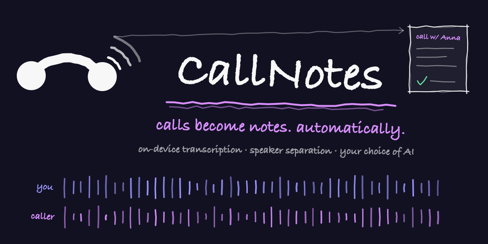
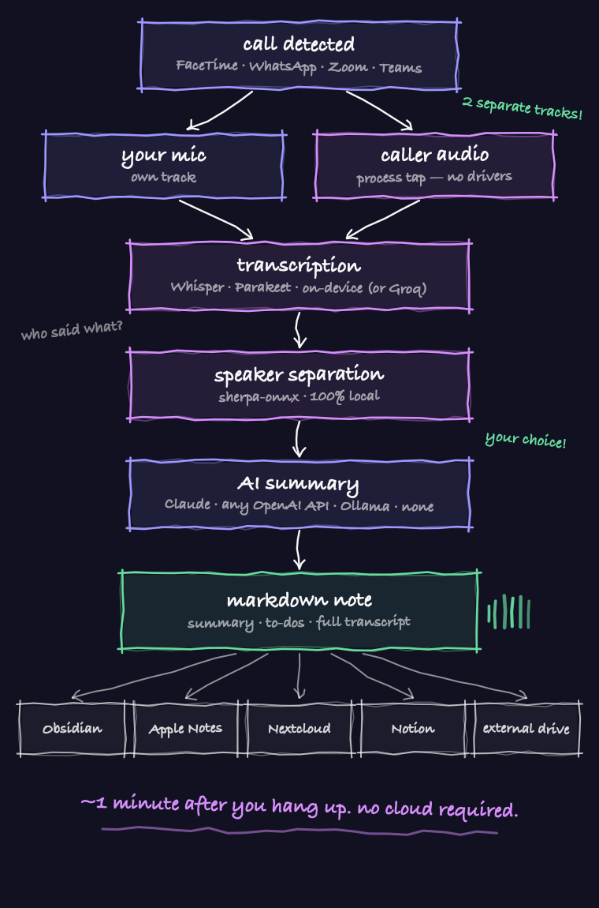
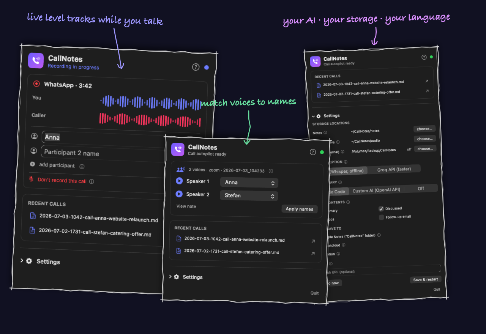

<p align="center">
  
</p>

<p align="center">
  <b>🇬🇧 English</b>&nbsp;&nbsp;·&nbsp;&nbsp;<a href="README.de.md">🇩🇪 Deutsch</a>
</p>

<h1 align="center">CallNotes</h1>

<p align="center">
  You take a call on your Mac — CallNotes records <b>both sides as separate tracks</b>,
  transcribes locally with Whisper, separates speakers, and drops a finished,
  AI-summarized note wherever you want it. Fully automatic, from the menu bar.
</p>

<p align="center">
  
  
  
  <a href="https://github.com/michaelczesun/callnotes-windows"></a>
</p>

<p align="center">
  <sub>🪟 On Windows? There's an experimental sibling: <a href="https://github.com/michaelczesun/callnotes-windows"><b>callnotes-windows</b></a></sub>
</p>

---

## Why this exists

Every call-recording tool either needs a virtual audio driver (BlackHole/Loopback),
a visible meeting bot, or a cloud subscription. CallNotes needs none of that:

- **Core Audio process taps** (macOS 14.2+) capture the system audio of *just the
  call app* — your caller lands on its own track, background music doesn't.
- Your microphone is recorded in parallel — **two separate tracks means perfect
  speaker attribution for 1:1 calls, no AI guessing needed.**
- For conference calls, local **speaker diarization** (sherpa-onnx) splits the remote
  mix into "Speaker 1..N" — you match names via short audio snippets and a dropdown.
- Transcription runs **on-device** — whisper.cpp (Metal) or **NVIDIA Parakeet TDT v3**
  (the fastest option, 25 EU languages, no repetition loops) — or via Groq API if you
  prefer cloud speed. Your choice, one toggle.
- **Bring your own AI** for summaries: Claude Code (default), any OpenAI-compatible
  API (OpenAI, Groq, OpenRouter), fully local via **Ollama** — or none at all.

## What you get after hanging up

A finished Markdown note, ~1 minute later:

- **Summary, discussed points, commitments & to-dos, open questions** (Claude, optional — pick the sections you want, including a follow-up email draft)
- **Dialog transcript with speakers** ("Me: … / Caller: …"), timestamps included
- **Stereo audio archive** (left = you, right = them)
- Delivered to your **notes folder** (Obsidian-friendly), plus optionally **Apple Notes,
  Nextcloud, Notion**, an **external drive mirror**, and an **ntfy push**

## How it works

<p align="center">
  
</p>

## The menu bar app

Everything lives in the menu bar (phone icon):

- **Live view during a call** — two animated level tracks (you + caller), call timer,
  and a popup to type in participant names while you still remember them
- **Processing status** after hangup (transcribing → speaker detection → AI summary)
- **Speaker assignment** for conferences: play a voice snippet per detected speaker,
  pick the name from a dropdown (Claude pre-suggests names it heard in the call)
- **Recent calls**, storage locations (incl. external drive), API keys, integrations
- **First-run setup wizard**, a built-in **help section**, and an ⓘ explainer next to
  every setting — you never have to guess what a field does
- **English & German UI** — follows your system language automatically

<p align="center">
  
</p>

## Install

**1. Dependencies** (Homebrew + Xcode Command Line Tools):

```bash
brew install whisper-cpp ffmpeg
```

**2. Clone & install:**

```bash
git clone https://github.com/michaelczesun/callnotes && cd callnotes
./install.sh
```

This builds **CallNotes.app into /Applications** (the settings & status app —
find it in your Applications folder or as the phone icon in the menu bar) and
the invisible recording helper **calltap.app into ~/Applications** (don't move
it — the recording permissions are tied to it). It also sets up the speaker
models (~35 MB), creates `~/.config/callnotes/config.json` and starts both
background services.

**3. Whisper model** (once, ~550 MB — on 8 GB machines `ggml-small.bin` is fine too):

```bash
mkdir -p ~/models && curl -L -o ~/models/ggml-large-v3-turbo-q5_0.bin \
  https://huggingface.co/ggerganov/whisper.cpp/resolve/main/ggml-large-v3-turbo-q5_0.bin
```

**4. Permissions — do this once.** Click the phone icon in the menu bar; the
setup wizard opens on first run (later: Settings → *Restart initial setup*). In
the **Permissions** step, click **"Request & check permissions now"** — the two
macOS dialogs appear (Microphone + System Audio Recording for "calltap"), allow
both, and the button confirms with a green check. Note: calltap only shows up in
System Settings' permission lists *after* this first request — that's macOS
behavior, not a missing entry.

**5. Test call** (>20 s) — about a minute after hanging up, the note appears in
your notes folder. Curious? `tail -f ~/CallNotes/log/process.log`.

**Updating later:** `cd callnotes && git pull && ./install.sh` — settings and
notes stay untouched.

## Uninstall

```bash
./uninstall.sh          # removes daemons + apps; keeps notes, config & models
./uninstall.sh --purge  # also removes working data, config, venv and models
```

Your notes folder is never touched.

## Supported call apps

FaceTime, iPhone calls via Continuity, WhatsApp, Zoom, Teams, Signal, Telegram,
Discord — anything that uses the microphone. The allowlist lives in the config;
find any app's bundle ID with `calltap procs --watch` during a call (unknown apps
are also logged automatically).

## Configuration

Everything is in `~/.config/callnotes/config.json` — or just use the menu bar
settings. Highlights:

| Key | What it does |
|---|---|
| `apps` | bundle IDs that trigger recording |
| `tapScope` | `app` = record only the call app family (default), `global` = all system audio |
| `transcriber` / `groqApiKey` | `local` (whisper.cpp), `parakeet` (fastest, `./install.sh --with-parakeet`) or `groq` (cloud) |
| `summarizer` (+ `summarizerUrl/Model/ApiKey`) | `claude` (Claude Code CLI), `openai` (any OpenAI-compatible API incl. Ollama/Groq/OpenRouter) or `off` |
| `noteSections` | which sections Claude writes: summary, discussed, todos, follow-up email |
| `destinations` | extra delivery: Apple Notes, Nextcloud (WebDAV), Notion |
| `notesDir` / `audioDir` / `mirrorDir` | where notes, audio and the external-drive mirror go |
| `diarize` / `diarizeThreshold` | multi-speaker detection on/off, clustering threshold |
| `speakerSelf` / `context` | your name in transcripts + one line of context for better summaries |

## CLI

```bash
calltap procs [--watch]     # which app is using the mic right now?
calltap record --out DIR    # manual two-track recording (Ctrl-C stops)
bash process-call.sh DIR    # (re)process a recording
bash callnotes-sync.sh      # mirror notes + audio to the external drive
```

## Troubleshooting

- **The permission button shows green but calltap is missing from the
  "Screen & System Audio Recording" list:** that's fine — on newer macOS
  versions tap-based apps may appear under **"System Audio Recording Only"**
  instead, or not be listed at all despite being granted. The source of truth is
  the daemon log: `grep "Self-Test" ~/CallNotes/log/callwatch.log` — "Systemaudio-Tap ok"
  means recording works.
- **The system-audio dialog never appears (mic dialog works) — and other
  tap-based tools fail on your Mac too:** that's a machine-level issue, not this
  app. Most common on **company-managed Macs**: an MDM/PPPC profile can block
  screen/system-audio capture prompts system-wide (check System Settings →
  General → Device Management, or `profiles list` in Terminal). On unmanaged
  Macs, a stuck permission database can be reset with
  `tccutil reset ScreenCapture at.dasgeht.calltap`, then request again via the
  wizard button. The daemon log names the exact error code:
  `grep "Tap verweigert" ~/CallNotes/log/callwatch.log`.
- **System track is silent (-91 dB):** the tap API returns *silence, not an error*,
  when the System Audio Recording permission is missing. Check System Settings →
  Privacy & Security → Screen & System Audio Recording → calltap.
- **No permission dialog ever appeared:** calltap must run as an app bundle via
  launchd (a bare CLI binary has no prompt identity). `./install.sh` handles this.
- **Recording never starts:** `tail -f ~/CallNotes/log/callwatch.log` — if it logs
  *"Mikro aktiv bei nicht gelisteter App"*, add that bundle ID to `apps`.
- **Caller audio missing in Electron apps** (WhatsApp/Discord/Teams): audio often
  plays in a helper process; `tapScope: "app"` covers the whole app family. If it
  still misses, set `"global"`.
- **Switched audio output mid-call** (connected AirPods): the running capture can
  go silent — switch before the call, or accept the gap.
- Failed jobs land in `~/CallNotes/failed/` with raw audio; reprocess with
  `bash process-call.sh <dir>`.

## FAQ

<details>
<summary><b>Does it run on Windows or Linux?</b></summary>
<br>

This repo is macOS-only (14.2+) by design — the driverless two-track capture is built
on Core Audio <i>process taps</i>. But there is an <b>experimental Windows sibling</b>
built on WASAPI process-loopback capture with the same pipeline and config format:
<b><a href="https://github.com/michaelczesun/callnotes-windows">callnotes-windows</a></b> —
CI-compiled, looking for testers. Linux (PipeWire per-app streams) would work the same
way — open an issue if you'd use one, PRs welcome.
</details>

<details>
<summary><b>Why no App Store / signed binary?</b></summary>
<br>

It's a <code>git clone && ./install.sh</code> tool for now. Everything builds locally
in seconds; nothing is downloaded except the Whisper and diarization models.
</details>

<details>
<summary><b>I opened Teams/WhatsApp and nothing happened?</b></summary>
<br>

That's expected: the popup and the recording start when a call is <b>actually
running</b> (the app is using your microphone) — not when you merely open the
app. Call someone and watch the menu bar icon change. Also: CallNotes is a
<b>menu bar app</b> (phone icon, top right) — since 1.2.1, double-clicking it in
Finder opens the panel as a window, and the panel tells you whether the recorder
service is running (green dot).
</details>

<details>
<summary><b>Intel or Apple Silicon?</b></summary>
<br>

Both. The requirement is <b>macOS 14.2+</b>, not the chip — Core Audio process
taps exist on Intel Macs too. On Intel, Whisper transcribes without Metal
acceleration (slower); consider the <code>ggml-small</code> model or the Groq
transcriber there.
</details>

<details>
<summary><b>Which call apps are supported?</b></summary>
<br>

Anything that uses the microphone: FaceTime, iPhone calls via Continuity, WhatsApp,
Zoom, Teams, Signal, Telegram, Discord — see <i>Supported call apps</i> above for
adding your own.
</details>

## Privacy & legal

Everything runs locally by default (Whisper on-device); only the summary — if
enabled — goes to the Claude API, and transcription goes to Groq only if you opt in.
**Tell people you're recording.** Laws differ by country (e.g., secretly *sharing*
recordings is criminal in Austria, secretly *making* them is criminal in Germany).
You are responsible for lawful use.

## License

[PolyForm Noncommercial 1.0.0](LICENSE) — free for personal and noncommercial use.
**Selling this software or using it commercially is not permitted.**

---

<p align="center"><sub><a href="README.de.md">🇩🇪 Diese Seite auf Deutsch</a></sub></p>
